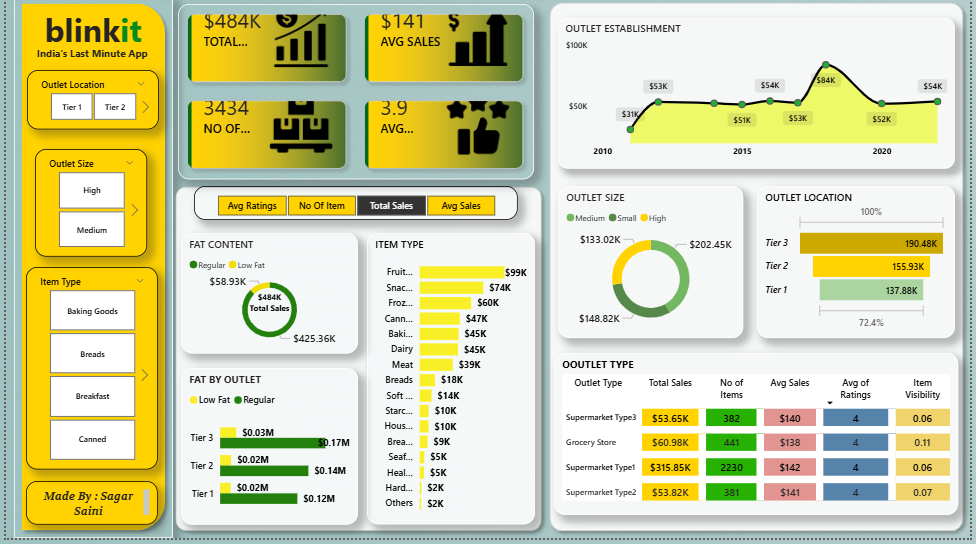

# Blinkit Power BI Dashboard

This repository contains an interactive Power BI dashboard created to analyze Blinkit (Grofers) data and extract meaningful business insights.

This project was built locally on my laptop and includes both:
- The Power BI dashboard file (.pbix)
- Raw data files used for analysis

---

## 👤 Author

**Name:** Sagar Saini  
**Role:** Aspiring Data Analyst  
**Skills:** Power BI, Excel, SQL, Basic Data Cleaning

---

## 📂 Project Structure

```
Blinkit-Dashboard/
│
├── reports/
│ └── Blinkit_Dashboard.pbix
│
├── data/
│ └── 
│
├── images/
│ └── dashboard.png
│
└── README.md
│
└── .gitignore
```


---

## 📊 Dashboard Preview


---

## 🔧 Tools Used

- Power BI Desktop  
- Microsoft Excel / CSV  
- Power Query  
- Basic DAX Measures

---

## 🚀 What This Dashboard Shows

- Sales overview and KPIs
- Category-wise performance
- City / store level analysis
- Price vs order trends
- Top performing and low performing items

---

## ▶️ How To Open

1. Download the PBIX file from:

```
reports/Blinkit_Dashboard.pbix
```

2. Open it using **Power BI Desktop**

3. If data connection breaks:
   - Go to **Transform Data → Data Source Settings**
   - Update file path to your local machine

---

## 🔎 Dataset Details

- Format: CSV / Excel
- Contains:
  - Orders
  - Products
  - Pricing & discounts
  - Store details
  - Date & time fields

Data is shared only for learning and practice purposes.

---

## 🙌 Feedback

If you have suggestions, improvements, or feedback — feel free to connect or open an issue.

Thank you for viewing my project.
